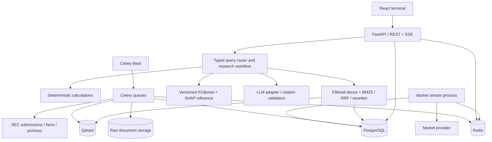

# Real Time Financial Intelligence Platform — architecture proposal

Status: approved by the user on 2026-09-28; Phase 1 implementation authorized. Prepared 2026-09-28. Statements below describe the proposal baseline; see phase reports for subsequent implementation status.

This document is the first-task deliverable, not an implementation claim. The repository was empty apart from Git metadata. Provider documentation has been reviewed; no authenticated market API, ingestion pipeline, model, or application has been tested or implemented.

## 1. Product scope and engineering decisions

Build a modular monolith with independently runnable API, ingestion workers, and market-stream processes. This gives clear boundaries without the operational cost of microservices. PostgreSQL is the system of record; Qdrant is a rebuildable retrieval index; Redis provides coordination, short-lived caching, and task transport. Persist original SEC responses and documents in an object-store abstraction, backed by a Docker volume locally and S3-compatible storage in deployment.

Initial issuers: NVIDIA, Microsoft, Apple, Amazon, Alphabet (Google), Meta, and Tesla. Resolve tickers/CIKs against SEC data during onboarding; model issuers separately from listed securities so Alphabet's share classes do not duplicate financial statements. Add companies through a validated administrative command initially, without code changes.

Proposed stack:

- React, TypeScript, Vite, Tailwind, TanStack Query, React Router, Recharts, and Lucide for the terminal interface.
- FastAPI, Pydantic settings/schemas, SQLAlchemy, Alembic, and PostgreSQL for APIs and durable data.
- Celery workers plus one Celery Beat scheduler; Redis for queues, distributed budgets, locks, and caches.
- Qdrant dense vectors; PostgreSQL-held canonical chunks and versioned BM25 indexes; application-level reciprocal rank fusion followed by a cross-encoder.
- Configurable Sentence Transformer embeddings and cross-encoder models, pinned by revision at implementation time.
- A provider-neutral LLM adapter. A configured compatible inference endpoint is required for generated explanations; structured data and source search remain usable without it.
- XGBoost and SHAP in a separate offline training pipeline and a versioned inference runtime.
- Docker Compose for reproducible local services; CI for linting, typing, tests, migrations, and builds.

Do not add LangGraph to the initial deterministic router. In Phase 10, use a small explicit graph for multi-step research state, conditional tool execution, evidence validation, and resumable research jobs; no unrestricted autonomous agent or LLM-generated SQL.

## 2. Architecture and data flow



Every displayed value carries provenance and freshness. A dataset may be successfully checked today while its most recent financial reporting period is months old. Neither condition implies a live financial metric.

## 3. External providers, entitlements, and limitations

### SEC EDGAR — primary filings and fundamentals

Use submissions for discovery, companyfacts for standard entity-level XBRL facts, and Archives for original filing documents and selected exhibits. SEC APIs require no API key. Submissions and XBRL update as filings are disseminated; companyfacts is not a complete representation of custom or segment-level disclosures. Fetch older submissions files for backfills. Backend access is necessary because data.sec.gov does not support browser CORS. [SEC API documentation](https://www.sec.gov/search-filings/edgar-application-programming-interfaces).

Use an identifying application/contact User-Agent, a shared request limiter, and bounded concurrency. SEC currently limits aggregate requests to 10 per second across machines; our proposed operational cap is 5 per second across all SEC workers, with backoff. [SEC developer resources](https://www.sec.gov/about/developer-resources).

### Alpaca — proposed first market adapter

For private portfolio development, use the IEX feed explicitly. It is real-time single-exchange data, not consolidated US-market pricing or volume. SIP provides consolidated data subject to subscription; the documented delayed SIP stream has a 15-minute delay. Never silently switch feeds. Display provider, feed, coverage, session, delay, and timestamp together. [Feed definitions](https://docs.alpaca.markets/us/docs/real-time-stock-pricing-data), [IEX versus SIP](https://docs.alpaca.markets/us/docs/market-data-faq).

The currently documented Basic plan allows 30 streamed equity symbols and 200 historical calls/minute; the latest 15 minutes of historical data are restricted. Entitlements must be checked with the actual account during implementation. These figures are configuration inputs, not promises of API availability. [Subscription documentation](https://docs.alpaca.markets/us/docs/about-market-data-api).

Public display/redistribution rights must be confirmed for the intended deployment. A personal API subscription is not evidence of redistribution permission. No trading endpoints or trading permissions are needed.

### Twelve Data — alternative adapter, especially for licensed public display

Its default US feed is real-time but covers only a subset of trading volume. External distribution requires the relevant add-on; full-market coverage is separately arranged. Confirm plan, attribution, storage, and display rights before choosing it for a public site. Implement this second adapter only when needed, against the same contract. [Coverage and licensing](https://support.twelvedata.com/en/articles/9935903-us-equities-market-data).

### Models and optional sources

Embedding/reranker model weights come from a model registry and are downloaded during provisioning, not API requests. Record license, revision, checksum, and vector dimension. Choose the LLM endpoint/model after local hardware, budget, and data-handling requirements are known; missing credentials produce a clear unavailable state. News is optional and excluded from the initial scope until a licensed source is selected. Filing-derived events are sufficient for the first dashboard.

No extra fundamentals vendor is required initially. Market capitalization may be unavailable: multiplying a current price by old SEC share counts must not be presented as a current vendor market cap. A computed approximation, if later added, needs explicit labeling and timestamps for both operands.

### Market provider contract

`MarketDataProvider` exposes `get_quote`, `get_intraday_data`, `get_historical_prices`, `get_volume`, `get_market_status`, capabilities/entitlements, and optional `stream_quotes`. All return normalized typed envelopes with field-level availability, source timestamps, feed, adjustment mode, currency, and provider identifiers. Unsupported fields are null with reasons, never zero-filled.

Historical bars retain interval, regular/extended-session flags, timezone, split/dividend adjustment mode, and revision. Quote price, last trade price, bid/ask, and daily close remain separate concepts. Compute change only from compatible feed/session/adjustment values. Calendar handling must account for holidays, early closes, and America/New_York daylight saving; persist UTC timestamps.

## 4. PostgreSQL logical schema

Use UUID primary keys except where natural identifiers are useful, `timestamptz` for instants, `date` for reporting periods, and exact `numeric` for reported financial amounts. API decimals are serialized safely rather than converted indiscriminately to binary floating point. Common mutable rows have created_at/updated_at. Financial source versions remain immutable.

### Entities and documents

- **companies**: id PK, cik unique, legal_name, fiscal_year_end, industry_code, active, metadata_source_id FK.
- **securities**: id PK, company_id FK, ticker, exchange, currency, share_class, valid_from/to; unique active ticker/exchange. Prices belong to securities; statements belong to companies.
- **source_objects**: id PK, provider, source_url, object_key, content_hash, retrieved_at, source_timestamp nullable, etag/last_modified nullable, media_type, byte_size; unique provider/url/content_hash. This is immutable raw lineage.
- **filings**: id PK, company_id FK, accession_number, form_type, filing_date, accepted_at, report_period, fiscal_year nullable, primary_document, source_object_id FK, amendment_of nullable FK, processing_status, error; unique(company_id, accession_number). Separate accession numbers preserve amendments.
- **filing_documents**: id PK, filing_id FK, document_name, document_type, source_object_id FK, parser_version, parse_status; unique(filing_id, document_name, source_object_id).
- **document_chunks**: id PK, filing_document_id FK, ordinal, section, page nullable, source_anchor nullable, start/end offsets, text, content_hash, token_count, parser_version, chunker_version, index_generation; unique(document_id, chunker_version, ordinal, content_hash). Store exact evidence text in PostgreSQL.
- **risk_factors**: id PK, filing_id FK, chunk_id FK, heading, taxonomy_label nullable, extraction_version. Labels are annotations, not model probabilities.

### Financial records

- **financial_statements**: id PK, company_id FK, filing_id FK, statement_type, period_start nullable, period_end, period_kind (instant/duration), fiscal_year, fiscal_period, currency, source_object_id FK, context_hash, normalization_version. Unique filing/type/context/version.
- **financial_facts**: id PK, statement_id nullable FK, company_id FK, filing_id FK, taxonomy, concept, value numeric, unit, period_start/end, fiscal_year/period, dimensions JSONB, context_hash, source_object_id FK, source_locator, available_at, normalization_version. Unique filing/concept/unit/context_hash/version. Preserve raw scale/decimals when available.
- **financial_metrics**: id PK, company_id FK, metric_name, period_start/end, period_basis (annual/quarter/TTM), value nullable, unit, formula_version, computed_at, available_at, input_set_hash, unavailable_reason; unique company/metric/period/basis/formula/input_set_hash.
- **metric_inputs**: metric_id FK and fact_id or input_metric_id FK, operand_name; a check requires exactly one input reference. Enables multi-filing calculation provenance.

Do not choose facts with a simple MAX(fiscal_year). Distinguish instantaneous balances, annual durations, quarterly durations, and year-to-date cash-flow facts; deduplicate contexts, preserve restatements, and select records by public availability cutoff. Derive discrete quarters from compatible YTD observations only with operand lineage. Custom taxonomy mapping is versioned and reviewed. ROE/ROA use average balances and explicit conventions. Undefined ratios, zero denominators, negative-base CAGR, and incompatible periods return an unavailable reason. EBITDA is calculated only when required components exist and the definition is explicit.

### Market, freshness, and processing

- **stock_prices**: security_id FK, provider/feed, interval, timestamp, adjustment_mode, session, OHLC numeric, volume numeric, source_timestamp, received_at, source_object_id FK, revision; unique security/provider/feed/interval/timestamp/adjustment/session. Partition by time as volume warrants.
- **market_quotes**: security_id FK, provider/feed, trade/bid/ask fields with their timestamps, received_at, provider_event_id, source_object_id nullable FK. Keep current snapshots and bounded history; do not archive all ticks by default.
- **data_source_state**: id PK, resource_key unique, provider/feed, last_attempted_fetch, last_successful_fetch, source_timestamp nullable, data_version, status, error_message sanitized, next_eligible_fetch, last_verified_at, policy_version, source_object_id nullable FK.
- **data_fetch_logs**: id PK, state_id FK, request_id, attempted_at, completed_at, outcome, HTTP status, retry_number, latency_ms, source_version, error_code/message; append-only, no secrets/full authenticated URLs.
- **ingestion_jobs**: id PK, filing_id FK, stage, pipeline_version, attempts, status, started_at, lease_until, completed_at, error; unique filing/stage/version.
- **outbox_events**: id PK, event_type, aggregate_id, version, payload, created_at, published_at; commit with business changes so work survives queue failures.
- **index_generations**: id PK, corpus scope, embedding/reranker metadata, chunker/BM25 versions, state, activated_at; defines a consistent retrieval snapshot.

### ML and research

- **model_versions**: id PK, artifact_uri/hash, feature_schema, target_definition, train/validation/test date ranges, training_data_hash, metrics JSONB, calibration_version, approved_at nullable, created_at.
- **ml_predictions**: id PK, company_id FK, model_version_id FK, feature_snapshot_hash, probability, category, threshold_version, prediction_at, data_as_of, valid_until; unique company/model/feature_snapshot_hash.
- **prediction_features**: prediction_id FK, feature_name, value, shap_value, source_metric_id FK; also store prediction base value, output space, and explainer version on the prediction metadata.
- **research_questions**: id PK, question, normalized_intent, requested_companies, requested_as_of, workflow/model versions, evidence_snapshot, typed_answer JSONB, status, latency_ms, created_at. Retention limits apply.
- **research_citations**: question_id FK, claim_id, chunk_id nullable FK, fact_id nullable FK, metric_id nullable FK, prediction_id nullable FK, exact_quote nullable, verification_status.

Index filings by company/form/accepted_at descending; facts by company/concept/period_end/available_at; chunks by filing/section; predictions by company/prediction_at; freshness by resource key. Check period ordering and valid probabilities; positive/negative signs follow fact semantics rather than blanket constraints. No user tables initially: local single-user deployment. Public research/write endpoints require an identity gateway or implemented authentication before exposure.

## 5. Qdrant and hybrid retrieval

Collection naming: `filing_chunks_<embedding_revision>_<generation>` behind an active alias. One point per canonical chunk, with deterministic UUID derived from document hash, chunker version, and ordinal. Named dense vector `text`, cosine distance, dimension read from the selected embedding model and validated on startup. Changing dimensions/model creates a new collection; never mix embeddings.

Payload: chunk_id, company_id, company, ticker aliases, cik, filing_id, accession_number, filing_type, filing_date, accepted_at, report_period, fiscal_year nullable, section, page nullable, source_url, source_anchor, document_hash, chunk_hash, parser/chunker/model versions, index_generation. Index company_id, filing_id, filing_type, accepted_at, fiscal_year, and section for filtering. HTML does not reliably have pages; show section/anchor instead of inventing page numbers.

Resolve scope in SQL before retrieval. “Latest 10-K risks” selects the latest accepted relevant 10-K/amendment policy, then filters both dense and BM25 candidates to the same permitted filing IDs. Prefer risk sections, with an explicit full-filing fallback if section detection fails. Distinguish fiscal year from filing year and enforce requested historical cutoffs.

Initial pipeline: dense top 40 + BM25 top 40 → RRF with versioned constant (initial proposal 60) → rerank at most 40 candidates → token-budgeted top 8 evidence chunks. These are tunable starting parameters, not measured optima. BM25 indexes are built from the canonical corpus by generation and loaded by scope; avoid truncating the corpus arbitrarily. Scale to a dedicated lexical search service only after profiling.

The Qdrant and lexical indexes activate only when the generation is complete and validated. A newly discovered unprocessed filing makes “latest” research pending/partial; an older filing must not silently answer as the latest one.

The LLM receives source IDs and typed tool outputs. Verify citation IDs, exact quotes, numeric claims against structured operands, and claim coverage. Citation existence alone is not proof of semantic support: unsupported claims are removed or returned with insufficient-evidence status. Treat filing text as untrusted content; it cannot authorize tools or alter system instructions.

## 6. Central freshness service

Return a `FreshnessEnvelope` with every quote, financial series, filing dataset, research tool result, and prediction:

`provider, feed, coverage, last_attempted_fetch, last_successful_fetch, last_verified_at, source_timestamp, data_version, status, error_message, is_fallback, next_eligible_fetch, refresh_state, reporting_period, policy_version`.

Keep three independent dimensions internally: provider transport health, source timeliness/entitlement, and processing completeness. The UI badge is a derived summary, not a stored permanent assertion.

- **UNAVAILABLE**: no usable observation or required provenance, missing credentials, or inaccessible data. Explain the cause.
- **STALE**: previous data is being served after a failed due refresh, a stream disconnect beyond tolerance, or an exceeded resource verification deadline. Display fallback and latest failure even when values have not changed.
- **DELAYED**: usable data is timely for a contractually delayed feed; show its configured delay. Data older than the delay plus tolerance becomes STALE.
- **LIVE**: entitled real-time feed, healthy stream, appropriate open session, and sufficiently recent provider event timestamps. A recent HTTP receipt alone cannot establish LIVE.
- **RECENT**: successfully verified non-live dataset or closed-session last close. Always show source date and reporting period. Missing source timestamps cannot qualify as LIVE.

Thresholds are policy settings per resource and provider. Proposed starting points: live-event tolerance 30 seconds for these liquid symbols, stream heartbeat tolerance 30 seconds, delayed-feed tolerance 2 minutes beyond contractual delay, SEC verification deadline twice its polling interval. Evaluate these with actual provider behavior; low trading activity is distinct from transport failure. Historical charts carry HISTORICAL as a data-kind label alongside verification freshness. Closed markets display the session and last close rather than a live badge.

“Always attempt newest” means continuously consume entitled streams or schedule a provider check as soon as the shared budget permits. On a read request, consult the stream/last verification and coalesce a due refresh. If rate limited, return a refresh-pending/deferred state with next eligible time. Never claim an outbound request occurred when only cache was read. Force-refresh requests cannot bypass provider budgets. Identical content or HTTP 304 can update last_verified_at without rewriting source timestamps or source versions.

Redis caches use TTL and keys including provider/feed, source generation, and adjustment basis. Suggested quote TTL 5 seconds; structured response cache 60 seconds plus generation invalidation. Research cache keys also include input data/index/model/prompt versions. Cache reads recalculate freshness and cannot extend validity or suppress due source checks. PostgreSQL retains recoverable state when Redis is lost.

## 7. SEC ingestion and worker design

1. Resolve tracked issuer metadata and validate identifiers.
2. Poll submissions every proposed 5 minutes with jitter; backfill historical submission pages separately. Support 10-K, 10-Q, 8-K and their amendments.
3. Upsert discovery metadata and an outbox event transactionally. Unique accession constraints prevent duplicate filings under concurrency.
4. Download primary document, selected relevant exhibits, and companyfacts with the shared limiter. Retry timeouts/429/5xx with exponential backoff and jitter; honor Retry-After. Stop unbounded retries on authentication/configuration errors.
5. Validate origin allowlist, response type, size, expected document identity, and content hash; store immutable raw objects. Quarantine malformed or unexpectedly large content.
6. Parse safely without executing HTML/scripts or fetching document-provided URLs. Retain headings, tables, anchors, and character offsets. Version parser output.
7. Normalize and validate structured facts with filing accession lineage. Companyfacts arrival may lag filing discovery; retry facts separately rather than declaring all ingestion failed.
8. Chunk by sections/tables with bounded overlap. Embed only new/changed chunks or explicit model migrations.
9. Upsert deterministic Qdrant points; build lexical generation; validate chunk counts/checksums before activation.
10. Recompute affected metrics and feature snapshots; enqueue inference only if input hashes changed and an approved model exists.
11. Mark completed stages separately and expose partial failures. Reconciliation requeues incomplete work after crashes.

Queues: `sec_io`, `parse`, `embed`, `metrics`, `inference`, `research`. CPU/model workers have bounded concurrency and memory limits; they cannot starve discovery. Celery delivery is treated as at-least-once. Use idempotency keys, task leases, timeouts, bounded retries, failed-job records, and administrative replay. A single Beat leader schedules tasks; distributed locks prevent overlap. The market WebSocket is a dedicated long-running process with reconnection and REST gap backfill, not an endless Celery task.

Daily reconciliation checks missed filings, failed stages, index consistency, and updated historical bars. Periodic fundamentals verification catches delayed fact availability and restatements even when no new accession was noticed. Provider circuit breakers remain bounded and show their next probe time.

## 8. Query routing, calculations, and response contract

Resolve company aliases, intent, metric, reporting basis, year/as-of cutoff, and comparison scope into a typed query plan. Permit multiple intents: a margin explanation needs structured facts/calculations plus document evidence. Rules cover exact market/metric requests; optional model classification must validate against an allowlist. Ambiguous periods or issuers produce clarification.

Routes: FINANCIAL_METRIC → SQL facts; FINANCIAL_CALCULATION → metric engine; DOCUMENT_RESEARCH → RAG; COMPARISON → aligned SQL/metrics plus optional RAG; RISK_ANALYSIS → approved inference plus evidence; MARKET_DATA → provider service; GENERAL_COMPANY_INFORMATION → sourced issuer metadata/documents.

The Decimal-based calculation engine covers growth, YoY, CAGR, gross/operating/net margins, FCF and growth, debt/equity, current ratio, ROE, ROA, and supported EBITDA formulas. Each result includes formula version, exact operands, units, period basis, source IDs, and unavailable reason when undefined. Compare like periods; label different fiscal year ends and do not silently treat them as identical calendar periods.

Research responses separate `retrieved_facts`, `calculated_values`, `market_data`, `model_outputs`, and `generated_explanation`, with claim-level sources and freshness. An unavailable LLM never blocks truthful structured responses. Long research uses POST → job ID → status/SSE; GET requests never wait for model downloads or training.

## 9. ML target and evaluation design

Proposed target: **probability that the next fiscal year's reported operating cash flow is negative**, using only information public at the prediction cutoff. This is a financial-condition warning, not bankruptcy probability, a stock-price forecast, or universal investment risk. The UI must name the target next to the probability.

Seven large technology issuers are inadequate for defensible training. Build a wider eligible non-financial US issuer cohort from historical SEC data, including historical/inactive issuers where available. Record sampling exclusions, missingness, sector composition, and survivorship limitations. A phase gate determines whether label coverage and class counts are sufficient; otherwise inference remains unavailable.

Features use reported financial ratios/growth available at cutoff. Labels come from a versioned subsequent annual filing outcome. Require label-period start after the feature cutoff and retain label publication timestamps. Purge overlapping outcome windows and embargo temporal boundaries; a training label must already be known at the next validation origin. Never use later restatements or retrospective companyfacts values as if known earlier.

Use chronological train/validation/held-out test splits, walk-forward validation, and an issuer-disjoint sensitivity check. Fit imputers and other transformations only on training data. Evaluate a prevalence baseline and logistic baseline against XGBoost. Tune thresholds/calibration on validation only; test once after selection. Report PR AUC for rare events, ROC AUC for ranking, precision/recall/F1 and confusion matrix at the selected threshold, and Brier score/reliability for probability quality. Include cohort size, event prevalence, uncertainty, and subgroup results. Accuracy is secondary.

Serialize model, preprocessing, feature order, checksums, cohort/label manifest, evaluation report, and model card. Only trusted approved artifacts may load. Train offline; request-time inference uses a fixed model. SHAP output must identify its output space (e.g. log-odds), base value, actual feature values, and signed contributions; check additivity against the model in that same space. SHAP explains model behavior, not causation. Store real prediction history; do not manufacture historical scores.

## 10. API and terminal interface

REST: `/api/companies`, `/api/companies/{ticker}`, and quote/history/financials/filings/risk subresources; `POST /api/research`, `GET /api/research/{id}`, `POST /api/compare`, `/api/data-freshness`, `/api/health/live`, `/api/health/ready`, and `/api/system-health`. Add source/chunk read endpoints and an SSE stream for market/research status. Paginate filings and bound symbols, history ranges, question size, and retrieval limits. Generate frontend types from OpenAPI.

Pages: market dashboard, company detail, research, comparison, risk, system health. Use a compact dark terminal shell, keyboard-friendly navigation, watchlist, price/volume charts, filing/event tables, and persistent source drawers. Watchlist top movers are explicitly scoped to tracked companies, not the entire market. Store local watchlists in browser storage initially.

Timeframes 1D/5D use intraday bars where entitled; longer ranges use daily bars. Missing bars stay gaps, not synthetic interpolation. Source drawer shows issuer/form/date/section, nullable page, exact passage and original URL. Research and comparison panels carry actual structured inputs. Risk shows unavailable until approved training and inference exist. Each panel has loading, partial, error, and genuine empty states.

Security: backend-only keys; strict CORS origins; typed validation; Redis-backed API limits; fixed outbound provider hosts; safe HTML/text rendering; source-link validation; no arbitrary SQL/tools from models; non-root containers; dependency scanning; log redaction. Local services bind to loopback, with databases on a private Docker network. Public deployment requires authentication/access controls for expensive operations and transport encryption.

Observability: JSON logs and trace/request IDs, request/provider/retrieval/reranker/LLM/DB/inference timings, queue age, failed jobs, freshness lag, latest discovered versus processed filing, and component readiness. `/health/live` only proves process liveness. Health probes report actual dependency checks and distinguish “configured,” “last success,” and “verified available.” Research traces store IDs and bounded metadata, not secrets.

## 11. Proposed repository structure

```text
MarketIQ/
  frontend/src/{components,pages,charts,hooks,services,types}
  backend/app/
    api/ core/ database/ models/ schemas/
    providers/{market,sec,embeddings,llm}/
    ingestion/ services/ rag/ agents/ ml/ workers/
  backend/alembic/
  backend/tests/{unit,integration,api,retrieval,ml}/
  scripts/{ingestion,evaluation,data}/
  ml/{training,evaluation,models}/
  evaluation/{questions,annotations,runs}/
  docker/
  docs/{architecture,decisions,operations}/
  .github/workflows/
  .env.example
  docker-compose.yml
  README.md
```

Raw data, weights, caches, credentials, and generated evaluation runs are excluded from Git as appropriate; small verified evaluation annotations may be versioned with source hashes. Lock Python/Node dependencies. Model downloads and datasets have separate reproducible manifests.

## 12. Environment-variable inventory

This is a design inventory; Phase 1 will create `.env.example` with safe placeholders and validation.

- Runtime: `APP_ENV`, `LOG_LEVEL`, `API_HOST`, `API_PORT`, `CORS_ORIGINS`, `PUBLIC_BASE_URL`, `REQUEST_TIMEOUT_SECONDS`.
- Storage: `DATABASE_URL`, `REDIS_URL`, `CELERY_BROKER_URL`, `CELERY_RESULT_BACKEND`, `QDRANT_URL`, `QDRANT_API_KEY`, `QDRANT_COLLECTION_ALIAS`, `RAW_STORAGE_BACKEND`, `RAW_STORAGE_PATH`; optional `S3_ENDPOINT`, `S3_BUCKET`, `S3_REGION`, `S3_ACCESS_KEY_ID`, `S3_SECRET_ACCESS_KEY`.
- SEC: `SEC_USER_AGENT`, `SEC_REQUESTS_PER_SECOND`, `SEC_POLL_SECONDS`, `SEC_BACKFILL_START_YEAR`, `SEC_MAX_DOCUMENT_BYTES`, `SEC_RECONCILE_SECONDS`.
- Market: `MARKET_DATA_PROVIDER`, `MARKET_DATA_FEED`, `MARKET_API_KEY`, `MARKET_API_SECRET`, `MARKET_REST_BASE_URL`, `MARKET_WS_URL`, `MARKET_REQUESTS_PER_MINUTE`, `MARKET_STREAM_SYMBOL_LIMIT`, `MARKET_DECLARED_DELAY_SECONDS`, `MARKET_POLL_SECONDS`, `MARKET_ADJUSTMENT_MODE`. Capabilities/actual entitlement responses validate settings; configuration alone cannot confer LIVE status.
- Freshness/retry: `LIVE_EVENT_TOLERANCE_SECONDS`, `STREAM_HEARTBEAT_TOLERANCE_SECONDS`, `DELAYED_TOLERANCE_SECONDS`, `QUOTE_CACHE_TTL_SECONDS`, `PROVIDER_MAX_RETRIES`, `PROVIDER_BACKOFF_MAX_SECONDS`.
- Retrieval: `EMBEDDING_PROVIDER`, `EMBEDDING_MODEL`, `EMBEDDING_REVISION`, `EMBEDDING_BATCH_SIZE`, `RERANKER_MODEL`, `RERANKER_REVISION`, `MODEL_CACHE_DIR`, `RAG_DENSE_K`, `RAG_SPARSE_K`, `RAG_RRF_CONSTANT`, `RAG_RERANK_K`, `RAG_FINAL_K`, `RAG_CONTEXT_TOKEN_BUDGET`.
- LLM: `LLM_PROVIDER`, `LLM_BASE_URL`, `LLM_API_KEY`, `LLM_MODEL`, `LLM_TIMEOUT_SECONDS`, `LLM_MAX_OUTPUT_TOKENS`.
- ML: `ML_MODEL_MANIFEST_PATH`, `ML_INFERENCE_ENABLED`, `ML_MAX_FEATURE_AGE_DAYS`. Target, feature schema, and threshold belong to the model manifest, not freely changeable inference environment flags.
- Operations: `WORKER_CONCURRENCY`, `TASK_TIME_LIMIT_SECONDS`, `API_RATE_LIMIT_PER_MINUTE`, `RESEARCH_RATE_LIMIT_PER_MINUTE`, `METRICS_ENABLED`, optional `OTEL_EXPORTER_OTLP_ENDPOINT`.
- Frontend: `VITE_API_BASE_URL` only; never place secrets in Vite variables.
- Future public identity: `AUTH_ISSUER`, `AUTH_AUDIENCE`, `AUTH_JWKS_URL`; enabled only with implemented authentication.

Tracked companies belong in the database with an initial seed configuration; they are not scattered environment variables. Provider URLs are validated against an allowlist.

## 13. Development phases and exit gates

Each phase ends with implementation, relevant tests, functionality verification, fixes, and a short evidence-based report before proceeding. No phase is marked complete on scaffolding alone. Lightweight test infrastructure begins in Phase 1; Phase 16 expands coverage rather than introducing testing for the first time.

1. **Repository/configuration:** monorepo skeleton, dependency locks, settings validation, lint/type/test configuration, secrets exclusions, CI entry points. Gate: clean setup and configuration tests pass. No provider keys required.
2. **SEC ingestion:** client, discovery, immutable raw storage, parsing, idempotent stage tracking. Gate: retry/duplicate/parser tests plus an identified live SEC smoke test. Minimal durable ingestion metadata is introduced here; Phase 3 completes financial modeling.
3. **PostgreSQL financial data:** migrations, normalization, lineage, temporal selection. Gate: real PostgreSQL migration/rollback and fact/restatement/period integration tests.
4. **Qdrant ingestion:** versioned embeddings, payload filters, generation activation. Gate: real Qdrant insert/replay/filter/rebuild tests.
5. **Basic RAG:** source retrieval and citations, refusal for absent evidence. Gate: passage/claim tracing tests; explicitly temporary baseline.
6. **Hybrid retrieval:** BM25 and RRF. Gate: same-scope retrieval tests and recorded baseline comparisons.
7. **Reranking:** bounded cross-encoder stage. Gate: ordering/latency measurements on recorded inputs; no unmeasured quality claims.
8. **Calculations:** versioned Decimal formulas and lineage. Gate: growth/CAGR/margin/FCF/ratio edge-case and incompatible-period tests.
9. **Routing:** typed intent/tool selection and comparison alignment. Gate: representative and ambiguous multi-intent questions.
10. **LangGraph workflow:** explicit research state and conditional orchestration. Gate: restart/failure/insufficient-evidence paths and citation validation.
11. **XGBoost:** cohort construction, target labels, chronological splits, training/artifacts/model card. Gate: leakage audit, sufficient labels, baseline comparison, held-out measurements. Insufficient data blocks model release.
12. **SHAP:** real signed contributions and explanation storage. Gate: additivity/output-space/feature-order checks against the trained artifact.
13. **FastAPI:** typed public endpoints, rate limits, provenance envelopes, job status. Gate: API success/failure/authorization/pagination tests and generated schema. Earlier phases use internal services/CLI entry points.
14. **React terminal:** all core pages, source viewer, real API states. Gate: TypeScript/build, accessible interactions, responsive visual review, browser end-to-end journeys.
15. **Market refresh:** live adapter, stream/reconnect/gap repair, freshness policies and SSE. Gate: authenticated provider test and controlled disconnect/rate-limit/session tests. Dashboard can honestly show unavailable before this phase.
16. **System testing:** cross-service and recovery/security coverage. Gate: full CI, worker crash/replay, provider outage, partial ingestion, and dependency failure scenarios.
17. **Evaluation:** at least 50 human-verified question/source/answer annotations across issuers and intents, with immutable filing hashes and held-out split. Gate: recorded dense/BM25/hybrid/reranked runs, Recall@K, Precision@K, MRR, nDCG where graded labels exist, correctness, faithfulness, citation accuracy, and latency. Human review is required; generated candidates do not count as manually verified.
18. **Docker:** complete Compose frontend/backend/postgres/qdrant/redis/worker/beat/market-stream services, volumes, migrations, readiness and startup documentation. Gate: clean-volume `docker compose up --build` and end-to-end smoke test. Minimal test containers may exist earlier.
19. **Deployment:** choose hosting from measured CPU/RAM/model/storage requirements; TLS, authentication, provider display rights, secrets, backups/restore, rollout/rollback, monitoring. Gate: deployed smoke test and restore/recovery verification. No hosting spend or public publication is assumed at architecture approval.

## 14. Approval scope and unresolved dependencies

Recommended approval: proceed with Phase 1 using the modular architecture above; private development defaults to Alpaca IEX with explicit limited-coverage labeling; SEC supplies fundamentals; ML targets next-year negative operating cash flow subject to dataset viability.

Later inputs: identifying SEC contact string; market account keys and actual entitlements; intended private/public audience and provider licensing; LLM choice/budget or local hardware; historical ML cohort coverage; human reviewers for the 50 evaluation questions; deployment host and budget. These do not block Phase 1. Do not put secrets in chat or Git.

No application code, dependencies, accounts, subscriptions, or deployment have been created by this proposal. Phase 1 starts only after the user's requested approval.
